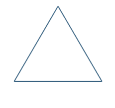
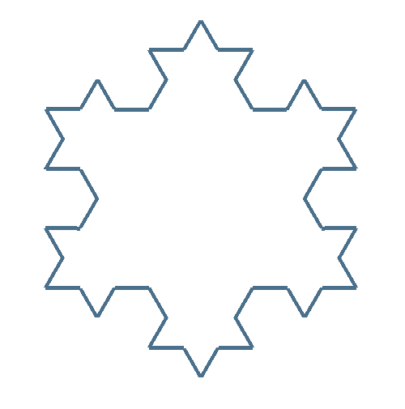
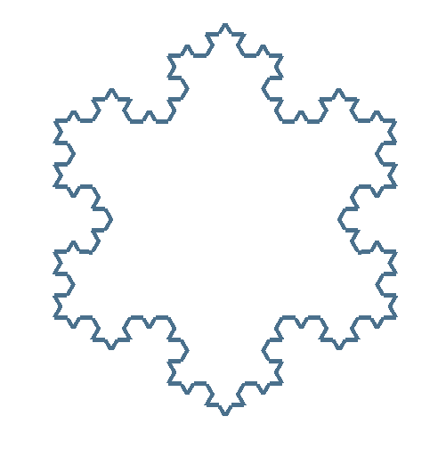
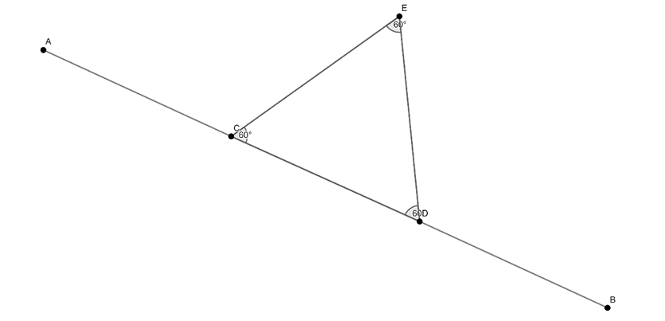
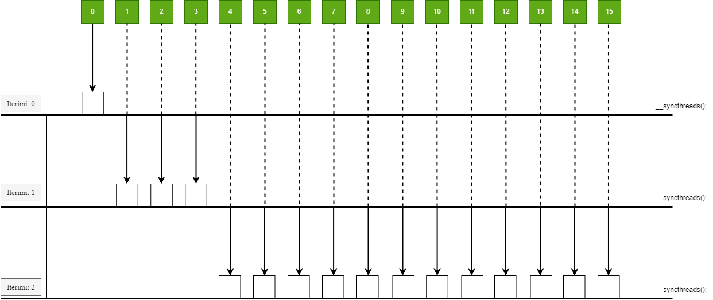
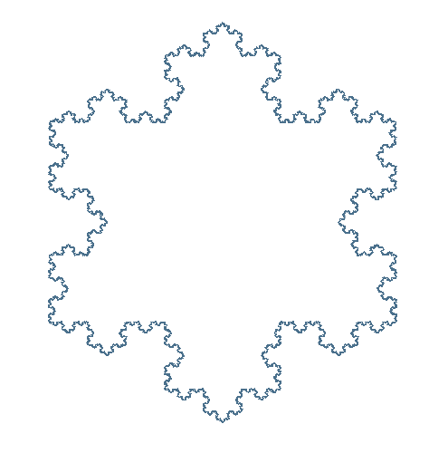
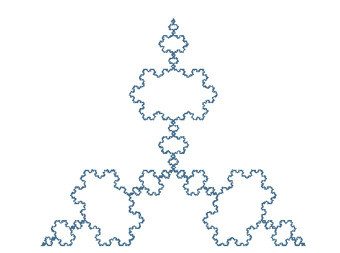

# Koch Snowflake

The Koch Snowflake is a classic example of a fractal, first described by the Swedish mathematician Helge von Koch in 1904. The fractal can be constructed starting from an equilateral triangle and then recursively altering each segment as follows:

1. Divide the segment into three equal parts.
2. Construct an equilateral triangle with the base being the middle segment obtained from the first step.
3. Remove the middle segment that is the base of the triangle from the second step.

   
The initial iterations of this fractal are shown below.

<div>
  <p>
    
    
    
    
  </p>
</div>

## Construction of the equilateral triangle

Let the points $A(x_1, y_1)$ and $B(x_2, y_2)$ be given. We need to find the points
$C$, $D$, $E$ such that  $\overrightarrow{AC}=\frac{1}{2}\overrightarrow{CB}$ ,
$\overrightarrow{DB}=\frac{1}{2}\overrightarrow{AD}$, so that $\triangle CDE$ is equilateral.

<p>
   
</p>


From the equation $\overrightarrow{AC} = \frac{1}{2}\overrightarrow{CB}$,
we get

$$\left( c_1 - x_1, c_2 - y_1 \right) = \frac{1}{2} \left( x_2 - c_1, y_2 - c_2 \right)$$


By equating the corresponding coordinates of the ordered pairs on both sides of the equation, we obtain

$$(c_1 - x_1) = \frac{1}{2} (x_2 - c_1)$$
$$(c_2 - y_1) = \frac{1}{2} (y_2 - c_2)$$

And we get the coordinates of the point C.

$C = (c_1, c_2) = \left( \frac{x_2 - 2x_1}{3}, \frac{y_2 - 2y_1}{3} \right)$.

In an anologous way, we can find the coordinates of the point $D$.


Triangle $\triangle CDE$ is equilateral and consequently each angle of it is 60 deegres. It is sufficient to rotate the point $D$ around the point $C$
for 60 deegres to obtain the point $E$.

$$e_1 = (d_1 - c_1) \cos\left(\frac{\pi}{3}\right) - (d_2 - c_2) \sin\left(\frac{\pi}{3}\right) + c_1$$

$$e_2 = (d_1 - c_1) \sin\left(\frac{\pi}{3}\right) + (d_2 - c_2) \cos\left(\frac{\pi}{3}\right) + c_2$$

\
If the angle of rotation is $-60$  deegres, we will get the fractal known as Koch Anti-Snowflake.

## Number of vertices

Let $f(n)$  be the total number of vertices of the figure in iteration $n$.
In iteration 0 we have 3 points, and after each iteration in each segment three points are added.

$$f(0) = 3$$

$$f(1) = 3f(0) + f(0) = 4f(0) = 4 \times 3$$

$$f(2) = 3f(1) + f(1) = 4f(1) = 4^2 \times 3$$

$$f(3) = 3f(2) + f(2) = 4f(2) = 4^3 \times 3$$

$$\vdots$$

$$f(n) = 3 \times 4^n$$

We use this sequence to tell OpenG how many points is going to connect as line segments, after we have calculated the coordinates of the points of the figure. 

```
void renderSnowflakeFromBuffer() {
     glColor3f(0.29f, 0.44f, 0.55f);
     glPointSize(7.0f);
     glVertexAttribPointer(0, 2, GL_FLOAT, GL_FALSE, 0, nullptr);
     glEnableVertexAttribArray(0);
     numberOfPoints = 3*pow(4, iterations);
     glDrawArrays(GL_LINE_LOOP, 0, numberOfPoints);
}
```

## Parallelization

Parallelization occurs hierarchically, where a certain number of threads will be active in each iteration. Each active thread will take the 
$i$-th edge of the figure and find the three points for constructing the triangle on the segment. Each thread will then insert the four found segments into the array of all edges.
This array contains all the edges generated for each iteration, and its size is:

$$h(n) = f(0) + f(1) + \cdots + f(n-1) = \sum_{i=0}^{n-1} f(i) = 3 \sum_{i=0}^{n-1} 4^i = 4^n - 1$$

<p>
   
</p>

\
For each iteration there will be $3 \times 4^n$ active threads. With the increase of
iterations, the number of active threads will rise exponentially:

1.  Iteration 0: Only the thread with id 0 is active. This thread initializes the initial triangle.

2.  Iteration 1: Threads 1-3 are active. Each thread takes the corresponding segment of the initial triangle and constructs an equileteral triangle on it.

3.  Iteration 2: Threads 4-15 are active. These threads take the segments from the previous iteration and construct equilateral triangles on them.

4.  Iteration n: Threads $4^(n-1)$ - $4^n$ are active. These threads take the segments from the previous iteration and construct equilateral triangles on them


This hierarchical approach ensures that each iteration fully utilizes the power of parallel processing. The figure below visualizes this thread process. 
The dashed lines indicate that the threads are waiting for the next iteration to become active.


## Kerneli

The following kernel generates the fractal through parallel computation. Initially, the thread with index 0 handles the initializing triangle.
For each iteration, threads within the interval start_at to end_at are active and compute the necessary points to form the Koch curve. 
The results are stored in the segment array, and the vertices are added to the points array for visualization. Synchronization ensures that all threads complete their tasks before proceeding to the next iteration.

```
    __global__ void kernel(float* points, Segment* segments, int start_iteration, int max_iteration , int inverted, int threadShiftIndex) {
        Point A,B,C,A1,B1,C1;
        Segment segment_1, segment_2, segment_3, segment_4;
        
        int idx = threadIdx.x + blockIdx.x * blockDim.x;
        idx += threadShiftIndex;
        
        if (idx == 0) {
        //CODE to handle the first iteration
        }

        auto g = cg::this_grid();
        __syncthreads();

        for (int iteration = start_iteration; iteration <= max_iteration; iteration++){
            int start_at = pow(4.0, iteration - 1);
            int end_at = pow(4.0, iteration);
            if (idx >= start_at && idx < end_at) {
                  //Segment to built Koch curve on
                Segment segment = segments[idx];
                A = segment.A;
                B = segment.B;
                triangleOnSegment(A, B, &A1, &B1, &C1, inverted);
                //Koch curve
                segment_1.A = A;
                segment_1.B = B1;
                segment_2.A = B1;
                segment_2.B = C1;
                segment_3.A = C1;
                segment_3.B = A1;
                segment_4.A = A1;
                segment_4.B = B;
                //Insert the generated koch curvers into segments array
                int offset = end_at + 4 * (idx - start_at);
                segments[offset] = segment_1;
                segments[offset + 1] = segment_2;
                segments[offset + 2] = segment_3;
                segments[offset + 3] = segment_4;
                //Insert vertices to points array
                offset = 2 * 4 * (idx - start_at);
                points[offset] = A.x;
                points[offset + 1] = A.y;
                points[offset + 2] = B1.x;
                points[offset + 3] = B1.y;
                points[offset + 4] = C1.x;
                points[offset + 5] = C1.y;
                points[offset + 6] = A1.x;
                points[offset + 7] = A1.y;
                points[offset + 8] = B.x;
                points[offset + 9] = B.y;
            }
            g.sync();
        }
    }
```

## Comparisions

Table below compares the excecution time in microseconds of the fractal between the sequential version and the parallel one. The CUDA implementation was done using cooperative groups, with 23,040 threads per kernel call. 

| Iteration | C++ (μs) | CUDA (μs) |
|-----------|----------|-----------|
| 0         | 2        | 23        |
| 1         | 3        | 26        |
| 2         | 16       | 41        |
| 3         | 17       | 29        |
| 4         | 50       | 37        |
| 5         | 140      | 25        |
| 6         | 787      | 27        |
| 7         | 2514     | 60        |
| 8         | 9101     | 93        |
| 9         | 37411    | 409       |
| 10        | 154053   | 1384      |
| 11        | 607546   | 5032      |
| 12        | 2240534  | 326359    |
| 13        | 9075431  | 3123194   |


<p>
   
</p>


<p>
   
</p>

